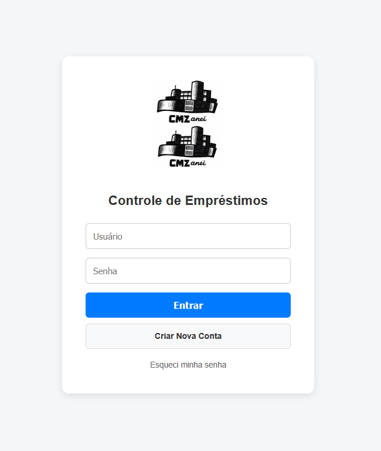
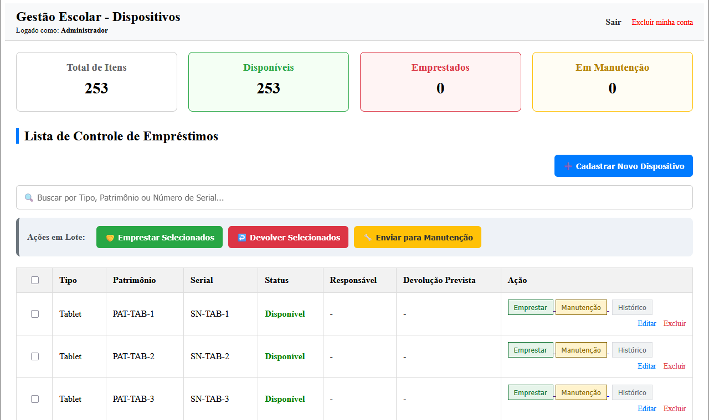
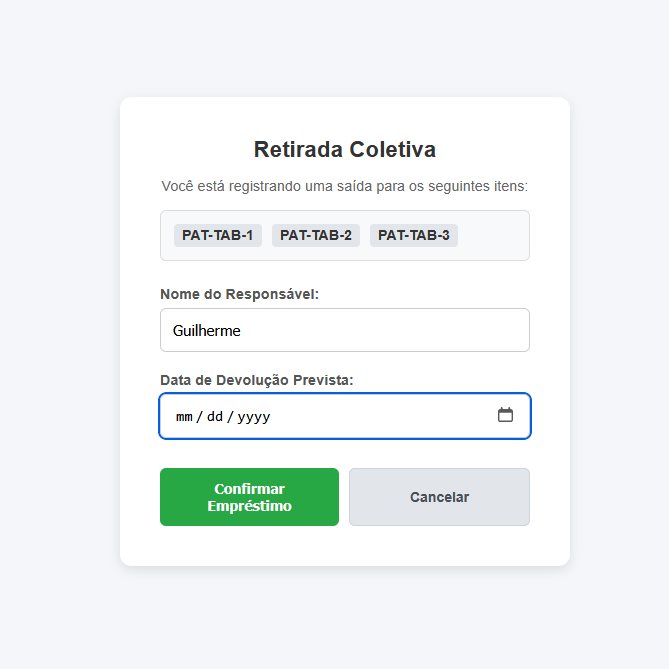
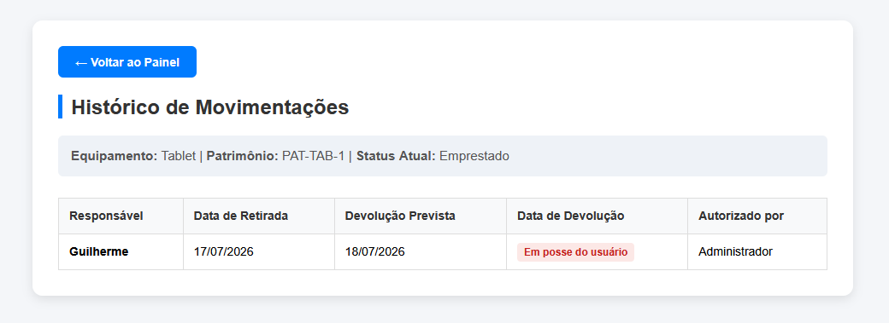

# School Device Manager

## Overview

A web application developed in Python and Flask to control and audit the loan of electronic devices (tablets and netbooks) in a school environment.


## Objective

This project was developed to improve the management of school device loans by replacing manual paper-based records with a centralized web application.


## Screenshots 

### Login



### Dashboard & Statistics



### Loan Screen



### History




## Features

### Device Management
- Batch loan
- Batch return
- Send devices to maintenance

### Audit
- Complete loan history
- Administrator identification
- Loan tracking

### Dashboard
- Real-time statistics
- Device availability

### Security
- Password hashing
- Password recovery


##  Technologies

- Python 3
- Flask (Web Framework)
- SQLite 3 (Relational Database)
- Jinja 2 (HTML Template Render Engine) 
- Werkzeug (Password Hashing and Security Utilities)


## Architecture

User —→ HTML Form —→ Flask Route —→
Business Logic —→ SQLite —→ HTML Response


## Project Structure
school-device-manager/
├── app.py
├── routes/
├── templates/
├── database/
└── static/

### app.py
App Initialization

### routes/
Contains application routes and handles user requests

### templates/
Stores HTML templates rendered by Flask using Jinja2

### database/
Contains the SQLite database

### static/
Stores CSS, JavaScript and image files


## How to Run 

```bash
git clone https://github.com/sgpard/school-device-manager.git
cd school-device-manager
pip install -r requirements.txt
python app.py
```


## Challenges

One of the biggest challenges during this project was organizing the loan history while keeping the device status synchronized with every operation.


## What I Learned

• Building web applications using Flask 
• Working with SQLite databases
• Organizing routes.
• Building CRUD operations.
• Separating application responsibilities


## Skills Demonstrated

• CRUD Operations
• Flask Routing
• SQLite Database
• Authentication
• Password Hashing
• HTML Templates
• Form Validation
• Software Documentation


## Future Improvements

• Improve input validation
• Add automated tests
• Migrate from SQLite to MySQL
• Rebuild the project using Java and Spring Boot


## Author

**Guilherme Silva**

- GitHub: [sgpard](https://github.com/sgpard)
- LinkedIn: [sgpard](https://linkedin.com/in/sgpard/)

